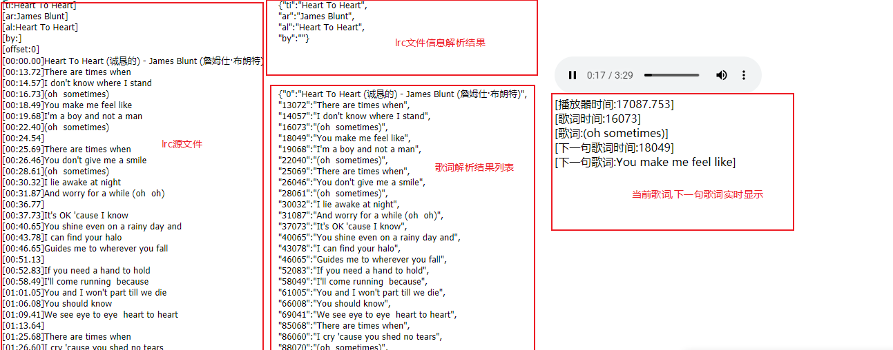
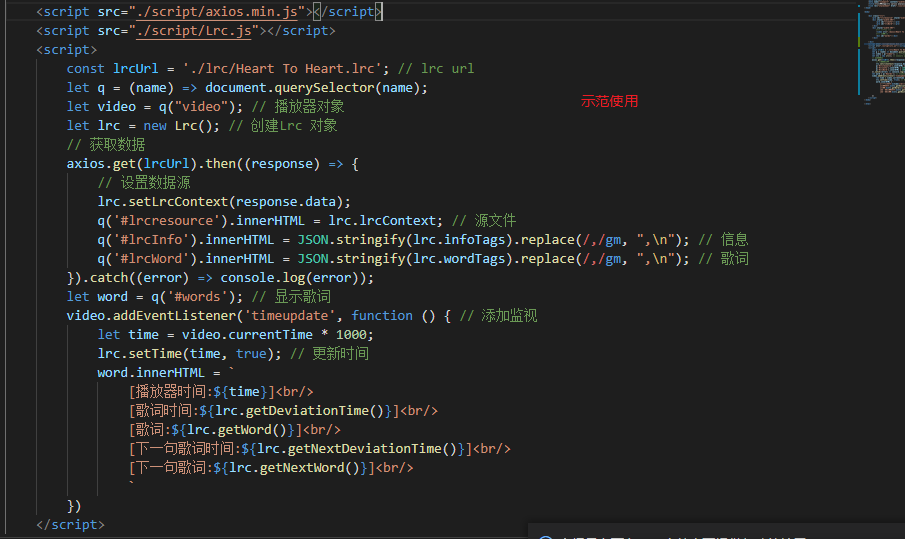

# LrcFile-Analysis v2.0
## lrc歌词文件解析 

## 与 v1.0 区别

1. 将 解析器 与 axios 分离,lrc 源文件需要自己获取
2. 新加入`下一句歌词`函数
3. 优化结构 简单易理解

## 介绍 

+ **这个[Lrc.js](./script/Lrc.js)脚本可以将网络上的lrc歌词文件解析出来,并可以跟随video,audio播放器显示歌词**

## 使用

1. 导入 [Lrc.js](./script/Lrc.js)
    ```html
    <script src="./script/Lrc.js"></script>
    ```

2. 创建 Lrc 对象

    ```javascript
    let lrc = new Lrc(); // 创建Lrc 对象
    lrc.setLrcContext(`lrc resource`); // 添加lrc源文件内容
    // 或者
    let lrc = new Lrc(`lrc resource`); // 创建Lrc 对象 初始化时就添加lrc源文件内容
    ```

    搭配 axios 使用

    ```javascript
    const lrcUrl = './lrc/Heart To Heart.lrc'; // lrc url
    let lrc = new Lrc(); // 创建Lrc 对象
    // 获取数据
    axios.get(lrcUrl).then((response) => {
        // 设置数据源
        lrc.setLrcContext(response.data);
    }).catch((error) => console.log(error));
    ```

3. 获取歌词
    ```javascript
    let video = document.querySelector("video")
    // 添加时间监视
    video.addEventListener('timeupdate', function () { 
        let time = video.currentTime * 1000;
        lrc.setTime(time, true); // 更新时间
        word.innerHTML = `
            [播放器时间:${time}]<br/>
            [歌词时间:${lrc.getDeviationTime()}]<br/>
            [歌词:${lrc.getWord()}]<br/>
            [下一句歌词时间:${lrc.getNextDeviationTime()}]<br/>
            [下一句歌词:${lrc.getNextWord()}]<br/>
            `
    })
    ```

## 简易 API 详见 [Lrc.js](./script/Lrc.js)

```javascript
// ===========================================
let lrc = new Lrc('lrc resource'?)
// 实例
// 属性
lrc.infoTags // 解析信息结果
lrc.wordTags // 解析歌词结果
// 实例方法
lrc.setLrcContext('lrc resource') //更换新歌词
lrc.setTime(0,true) //设置当前时间
lrc.getWord() //获取当前歌词
lrc.getDeviationTime() //获取当前歌词时间
lrc.getNextWord() //获取下一句歌词
lrc.getNextDeviationTime() //获取下一句歌词时间
// ===========================================
// 静态
// 方法
Lrc.getInfoTags('lrc resource') // 解析lrc 信息
Lrc.getWordTags('lrc resource') // 解析lrc 歌词

```

## 效果


## 截图

简单使用



具体代码


